<!--
  Birditch · GitHub Profile README
  Theme: Tokyo Night / React-dark · Accent: #58a6ff
-->

<a name="top"></a>

<p align="center">
  
</p>

<p align="center">
  <a href="https://github.com/Birditch">
    
  </a>
</p>

<p align="center">
  <a href="https://github.com/Birditch?tab=repositories"></a>
  
  <a href="https://github.com/Birditch?tab=followers"></a>
  
  <a href="https://github.com/Birditch/NetMedic/stargazers"></a>
</p>

---

## 👋 About me

```ts
const birditch = {
  name:        "Birditch",
  pronouns:    "he/him",
  location:    "New York, NY (UTC−04:00)",
  focus:       ["Network tooling", "Developer experience", "Cross-platform CLIs"],
  stack:       ["Python", "TypeScript", "Rust-curious", "Bash/PowerShell"],
  currently:   "Hardening NetMedic's DoH + NRPT split-DNS pipeline",
  philosophy:  "Software that solves a real problem and then gets out of the way.",
};
```

I write infrastructure-level developer tools — the boring kind that quietly fix the network at 2 a.m. so you can keep shipping.
My favorite kind of bug report is *"it's just slow sometimes"* — that's where DNS, MTU, and PMTUD usually live.

---

## 🚀 Featured project — NetMedic

<table>
  <tr>
    <td width="55%">
      <h3>🩺 <a href="https://github.com/Birditch/NetMedic">NetMedic</a></h3>
      <p><em>Cross-platform DNS &amp; network diagnostic / repair tool.</em></p>
      <ul>
        <li>Windows full backend with <strong>DoH + NRPT split DNS</strong></li>
        <li>macOS / Linux pure-Python runtime preview</li>
        <li>Tuned for <strong>soft-router</strong> and <strong>port-53 hijack</strong> troubleshooting</li>
        <li>Beautiful TUI powered by <code>rich</code> + <code>typer</code></li>
      </ul>
      <p>
        <a href="https://github.com/Birditch/NetMedic"></a>
        <a href="https://github.com/Birditch/NetMedic/wiki"></a>
        
        
      </p>
    </td>
    <td width="45%" align="center">
      <a href="https://github.com/Birditch/NetMedic">
        
      </a>
    </td>
  </tr>
</table>

---

## ✨ Highlights

<table>
<tr>
<td valign="top" width="50%">

#### 🛠 What I build
- **Network surgery CLIs** — DoH proxies, NRPT split-DNS, port-53 forensics
- **Diagnostic UIs** — terminal-first, multi-platform, no Electron
- **Plumbing for plumbing** — install scripts, Homebrew taps, MSI packaging
- **Reliability tooling** — readiness probes, retry budgets, backoff-aware clients

</td>
<td valign="top" width="50%">

#### 🧠 What I'm learning
- 🦀 Rust async ecosystems (`tokio`, `hyper`, `quinn`)
- 🌐 QUIC / HTTP/3 transport internals
- 📡 eBPF for userspace network observability
- ⚙️ Property-based testing for protocol code

</td>
</tr>
<tr>
<td valign="top" width="50%">

#### 🏗 Engineering values
- Boring tech, surprising reliability
- Optimize for the *second* user, not the first
- Logs are a UI — write them like one
- Every CLI flag is a future support ticket

</td>
<td valign="top" width="50%">

#### 🌱 Open-source posture
- Maintainer-friendly issues (repro + version + OS)
- Conventional commits & semantic releases
- Docs are part of done — not a follow-up
- License: MIT, attribution gladly accepted

</td>
</tr>
</table>

---

## 📊 GitHub statistics

<p align="center">
  
  
</p>

<p align="center">
  
  
</p>

### 📈 Contribution activity (last year)

<p align="center">
  
</p>

### 📅 This week I spent my time on

<!-- BLOCK:wakatime-start -->
<p align="center">
  
</p>
<!-- BLOCK:wakatime-end -->

<details>
<summary>📊 <strong>Detailed metrics</strong> (auto-refreshed daily by GitHub Actions)</summary>

<p align="center">
  
</p>

<p align="center">
  
  
</p>

</details>

---

## 🐍 Contribution snake

<p align="center">
  
</p>

---

## 🏆 Trophies

<p align="center">
  <a href="https://github.com/ryo-ma/github-profile-trophy">
    
  </a>
</p>

---

## 🧰 Tech I reach for

<p align="center">
  
</p>

---

## 📡 Reach me

<p align="center">
  <a href="https://github.com/Birditch">
    
  </a>
  <a href="https://github.com/Birditch/NetMedic/issues/new/choose">
    
  </a>
  <a href="https://github.com/Birditch/NetMedic/discussions">
    
  </a>
</p>

---

<p align="center">
  <em>"Make it work, make it right, make it boring." — Birditch, every commit message I wish I'd written.</em>
</p>

<p align="center">
  
</p>

<p align="center"><a href="#top">⬆ back to top</a></p>
