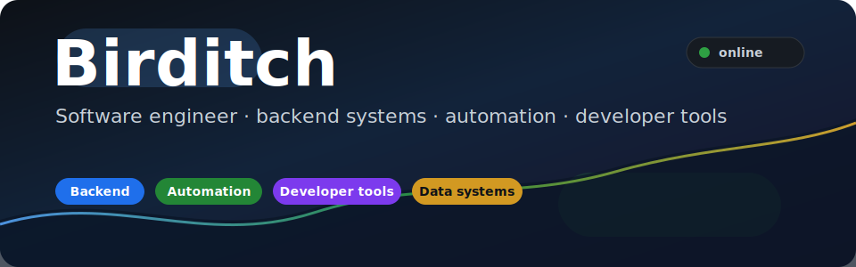
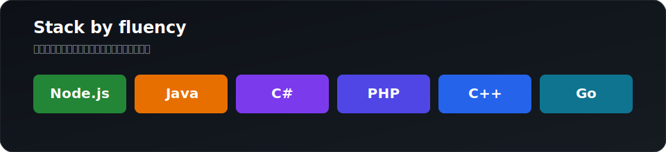
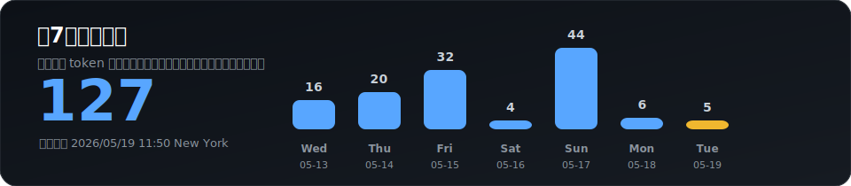

<!--
  Birditch · GitHub Profile README
  这是 GitHub special repository：README.md 会显示在公开个人主页。
-->

<a name="top"></a>

<p align="center">
  
</p>

<p align="center">
  <a href="https://github.com/Birditch?tab=repositories">
    
  </a>
  <a href="https://github.com/Birditch?tab=followers">
    
  </a>
  
</p>

---

## 关于我

```ts
const birditch = {
  role: "Software engineer / builder",
  location: "New York, NY",
  stackByFluency: ["Java", "Node.js", "Python", "PHP", "C#", "C++", "Rust", "..."],
  focus: ["backend systems", "automation", "developer tools", "network/runtime diagnostics"],
  preference: "把复杂问题拆到可验证、可维护、可持续迭代。",
};
```

我更喜欢做能长期运行的工程系统：稳定的后端、清晰的自动化、可观测的工具链，以及真正能减少重复劳动的产品细节。

---

## 技术栈

<p align="center">
  
</p>

<p align="center">
  
</p>

---

## 工程方向

<table>
  <tr>
    <td width="50%" valign="top">
      <h3>系统与后端</h3>
      <ul>
        <li>Java / Node.js 服务端工程</li>
        <li>API 设计、鉴权、任务队列和数据一致性</li>
        <li>部署、监控、回滚和运行时配置</li>
      </ul>
    </td>
    <td width="50%" valign="top">
      <h3>工具与自动化</h3>
      <ul>
        <li>Python / PHP / Shell 自动化脚本</li>
        <li>跨平台 CLI、诊断工具和批处理流程</li>
        <li>CI/CD、GitHub Actions 和质量门禁</li>
      </ul>
    </td>
  </tr>
  <tr>
    <td width="50%" valign="top">
      <h3>底层与性能</h3>
      <ul>
        <li>C# / C++ 桌面和系统侧能力</li>
        <li>网络、文件、进程和平台 API 集成</li>
        <li>对 Rust 的工程化落地保持投入</li>
      </ul>
    </td>
    <td width="50%" valign="top">
      <h3>产品化</h3>
      <ul>
        <li>从原型到可维护版本的完整闭环</li>
        <li>文档、错误处理、用户路径和长期维护</li>
        <li>让工具解决问题，而不是制造新的操作负担</li>
      </ul>
    </td>
  </tr>
</table>

---

## GitHub 数据

<p align="center">
  
</p>

<details open>
<summary><strong>近1年贡献活动</strong></summary>

<p align="center">
  
</p>

</details>

<details>
<summary><strong>自动刷新指标</strong></summary>

<p align="center">
  
</p>

<p align="center">
  
</p>

</details>

---

## Contribution Snake

<p align="center">
  <picture>
    <source media="(prefers-color-scheme: dark)" srcset="https://raw.githubusercontent.com/Birditch/Birditch/output/github-contribution-grid-snake-dark.svg"/>
    
  </picture>
</p>

---

## 项目观

我不把单个仓库当作唯一代表作。不同阶段会做不同类型的项目：有的是产品，有的是脚本，有的是基础设施，有的是用来验证技术路线的工程样本。对我来说，更重要的是代码能否被验证、能否持续运行、能否被后来的人读懂和维护。

---

<p align="center">
  <em>Make it useful. Make it reliable. Make it maintainable.</em>
</p>

<p align="center"><a href="#top">Back to top</a></p>
