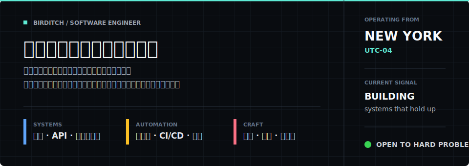
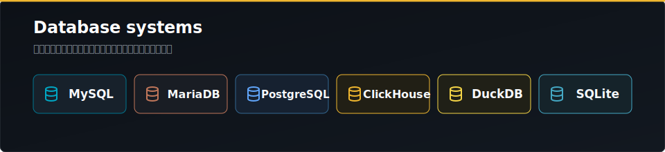

<!--
  Birditch · GitHub Profile README
  这是 GitHub special repository：README.md 会显示在公开个人主页。
-->

  

  
  
  

---

## 关于我

  

---

## 真实语言使用

  

---

## 组织与协作

  

---

## 数据库

  

---

## 工程方向

<table>
  <tr>
    <td width="50%" valign="top">
      <h3>系统与后端</h3>
      <ul>
        <li>服务端与跨平台客户端工程</li>
        <li>API 设计、鉴权、任务队列和数据一致性</li>
        <li>部署、监控、回滚和运行时配置</li>
      </ul>
    </td>
    <td width="50%" valign="top">
      <h3>工具与自动化</h3>
      <ul>
        <li>自动化脚本与工作流编排</li>
        <li>跨平台 CLI、诊断工具和批处理流程</li>
        <li>CI/CD、GitHub Actions 和质量门禁</li>
      </ul>
    </td>
  </tr>
  <tr>
    <td width="50%" valign="top">
      <h3>底层与性能</h3>
      <ul>
        <li>桌面和系统侧能力</li>
        <li>网络、文件、进程和平台 API 集成</li>
        <li>对跨平台工程化落地保持投入</li>
      </ul>
    </td>
    <td width="50%" valign="top">
      <h3>产品化</h3>
      <ul>
        <li>从原型到可维护版本的完整闭环</li>
        <li>文档、错误处理、用户路径和长期维护</li>
        <li>让工具解决问题，而不是制造新的操作负担</li>
      </ul>
    </td>
  </tr>
</table>

---

## GitHub 数据

  

<strong>近1年贡献活动</strong>

  

---

## Contribution Snake

  <picture>
    <source media="(prefers-color-scheme: dark)" srcset="https://raw.githubusercontent.com/Birditch/Birditch/output/github-contribution-grid-snake-dark.svg"/>
    
  </picture>

---

## 项目观

我不把单个仓库当作唯一代表作。不同阶段会做不同类型的项目：有的是产品，有的是脚本，有的是基础设施，有的是用来验证技术路线的工程样本。对我来说，更重要的是代码能否被验证、能否持续运行、能否被后来的人读懂和维护。

---

  <em>Make it useful. Make it reliable. Make it maintainable.</em>

<a href="#top">Back to top</a>

